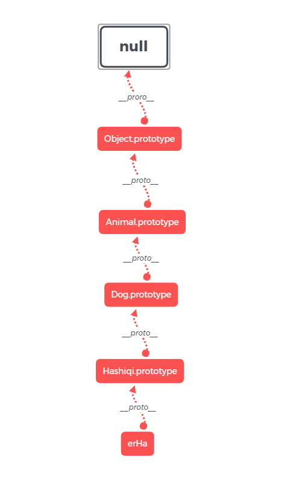

## 前言
说起原型链一直以来知道的都是沿着原型链向上找某个方法或属性。但是具体是怎么向上找的一直没有去搞清楚过。

这次通过Animal, Dog 和 Hashiqi三个构造函数， 来彻底搞懂原型及原型链。  并通过原型和原型链去了解一下Javascript内部的结构

如有建议，欢迎留言。

## 一、 术语

### 1.1 构造函数

如名称所示，构造函数是一个函数， 用来创建实例。  


Javascript内置有一些原生构造函数，如Object, Array, Function等。  也可以创建自己的构造函数，约定命名以大写字母开头，如下面将说到的Animal, Dog 和 Hashiqi。


通过new操作符调用构造函数,及可创建出一个对应的实例出来。

### 1.2 实例

由构造函数创建出来的具体“对象”，比如我们可以由Dog这个构造函数创建出来一只具体的blackDog出来。

### 1.3 原型对象

每一个构造函数都有一个prototype属性，指向其原型对象。该原型对象包含可以由特定类型所有实例共享的属性和方法。

> 注意：箭头函数没有prototype属性，ES6规定箭头函数不可做为构造函数用new操作符调用，否则会抛出错误。

除此之外每一个实例包含一个[[Prototype]]属性，指向该实例构造函数的原型对象。[[Prototype]]无法直接访问，一般浏览器将该属性实现为__proto__。这个属性是实现原型链的关键。

## 二、 通过具体示例分析原型和原型链

### 2.1 创建三个构造函数

```javascript
function Animal (legNum, color) {
  this.color = color
  this.legNum = legNum
}

Animal.prototype.eat = function() {
  console.log('吃')
}
Animal.prototype.move = function() {
  console.log('动')
}

function Dog (legNum, color, skill) {
  Animal.call(this, legNum, color)
  this.skill = skill
}

Dog.prototype = Object.create(Animal.prototype)
Dog.prototype.say = function () {
  console.log('汪汪')
}
Dog.prototype.constructor = Dog

function Hashiqi () {
  Dog.apply(this, arguments)
}

Hashiqi.prototype = Object.create(Dog.prototype)
Hashiqi.prototype.constructor = Hashiqi
```

现在有了三个构造函数，Animal、 Dog 和 Hashiqi。Animal是Dog的父类，Dog是Hashiqi的父类，符合日常生活经验。  

### 2.2 创建一个哈士奇实例来分析原型和原型链

```javascript
var erHa = var erHa = new Hashiqi(4, '灰', '拆家')

console.log(erHa)
// Hashiqi { color: '黑', legNum: 4, skill: '拆家' }
// 现在有了一只四条腿颜色为灰色会拆家的二哈，拿它来具体分析一下

erHa.say() // 汪汪
erHa.move() // 动
console.log(erHa.__proto__)
console.log(erHa.__proto__ === Hashiqi.prototype)
// Hashiqi { constructor: [Function: Hashiqi] }
// true

console.log(Dog.prototype)
// Dog { say: [Function], constructor: [Function: Dog] }

console.log(Animal.prototype)
// Animal { eat: [Function], move: [Function] }
```

通过上面代码及打印结果可以看到，erHa实例自身的属性仅有color、legNum和skill（可以通过hasOwnProperty方法验证）。 但是调用say和move方法却可以调用成功。say方法来自于Dog的原型对象，move方法来自Animal的原型对象。符合一直以来知道的知识，实例上找不到的方法或属性会沿着原型链向上找。  

接下来继续分析具体是如何沿着原型链向上找的。

```javascript
console.log(erHa.__proto__) // Hashiqi.prototype
console.log(erHa.__proto__.__proto__) // Dog.prototype
console.log(erHa.__proto__.__proto__.__proto__) // Animal.prototype
console.log(erHa.__proto__.__proto__.__proto__.__proto__) // Object.prototype
console.log(erHa.__proto__.__proto__.__proto__.__proto__.__proto__) // null

// erHa.__proto__.__proto__.__proto__.__proto__.__proto__很像一条长长的链子
```

通过上面打印结果就可以比较清晰的看到原型链的具体逻辑：  
erHa实例的__proto__属性指向Hashiqi的原型对象，  
Hashiqi原型对象的__proto__属性指向Dog的原型对象，  
Dog原型对象的__proto__属性指向Animal的原型对象，  
Animal原型对象的__proto__属性指向Object的原型对象，  
Object原型对象的__proto__属性最终指向null。



### 2.3 注意项

原型链需要正确的继承方法才可生成，错误的继承方式会导致原型链截断  
现在修改Hashiqi构造函数来演示一下

```javascript
function Hashiqi () {
  Dog.apply(this, arguments)
}

Hashiqi.prototype = Object.assign({}, Dog.prototype)
Hashiqi.prototype.constructor = Hashiqi

console.log(erHa.__proto__) // Hashiqi.prototype
console.log(erHa.__proto__.__proto__) // Object.prototype
erHa.move() // error
```

如上所示，直接通过Object.assign拷贝父类原型的方式实现继承，会导致原型链断掉。Hashiqi此时的原型对象直接为Object的实例。

## 三、 了解Javascript内部结构

```javascript
console.log(Object.prototype.__proto__) // null
console.log(Object.prototype)

console.log(Function.prototype.__proto__ === Object.prototype)
console.log(Array.prototype.__proto__ === Object.prototype)
console.log(Number.prototype.__proto__ === Object.prototype)
console.log(String.prototype.__proto__ === Object.prototype)
console.log(Boolean.prototype.__proto__ === Object.prototype)
console.log(RegExp.prototype.__proto__ === Object.prototype)
console.log(RegExp.prototype.__proto__ === Object.prototype)
console.log(Symbol.prototype.__proto__ === Object.prototype)

console.log(Object.__proto__ === Function.prototype) 
console.log(Function.__proto__ === Function.prototype)
console.log(Array.__proto__ === Function.prototype)
console.log(Number.__proto__ === Function.prototype)
console.log(String.__proto__ === Function.prototype)
console.log(Boolean.__proto__ === Function.prototype)
console.log(RegExp.__proto__ === Function.prototype)
console.log(Symbol.__proto__ === Function.prototype)

console.log(Function instanceof Object)
console.log(Object instanceof Function)
```

尝试运行一下上面代码，可以发现Javascript原型链顶层为null，这也可以解释为何typeof null结果为objcet。  

null之后是Object.prototype，Javascript世界中一切对象皆可调用其上的方法（没有被子类改写的话）。

其次比较特殊的是Function构造函数，Javascript世界中所有构造函数均由其生成。与Objcet构造函数是一个蛋生鸡鸡生蛋的关系。

## 四 undefined

最后可以思考一下undefined在Javascript世界中所处的角色是什么。  
比如这里应该有内容但是现在并没有...