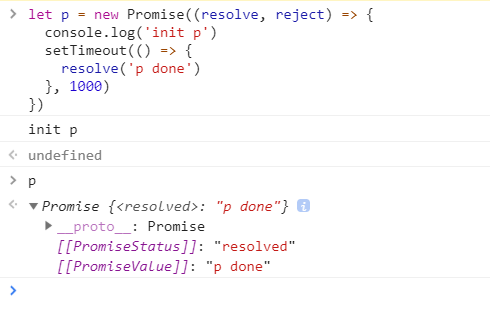

## 前言

Promise技术的出现将我们广大前端从异步的回调地狱中解救了出来，成为了如今Javascript内处理异步必不可少的方法。接下来我自己去实现一个Promise，进入Promise内部去看一下其执行机制。

## 一、Promise的语法

**静态方法：**  

- Promise​.all()
- Promise​.race()
- Promise​.reject()
- Promise​.resolve()

**实例方法：**  

- Promise​.prototype​.catch()
- Promise​.prototype​.finally()
- Promise​.prototype​.then()

具体语法参考 [Promise-MDN](https://developer.mozilla.org/zh-CN/docs/Web/JavaScript/Reference/Global_Objects/Promise)

## 二、 通过具体例子分析逐步实现自己的Promise

### 2.1 实例化

new Promise( function(resolve, reject) {...} /* executor */  );
```javascript
let p = new Promise((resolve, reject) => {
  console.log('init p')
  setTimeout(() => {
    resolve('p done')
  }, 1000)
})

// init p
```

> 从以上代码及执行结果可看出，Promise实例化时接收一个函数作为参数，该函数传入了两个内部方法resolve, reject，该函数会立即执行。当传入参数不是函数时会出错。  

> 由MDN文档可知Promise有三个状态，初始为pending，操作成功完成后变为fulfilled，操作失败后变为rejected。此外Promise还有一个value值。



根据以上分析实现代码为

```javascript
const PENDING = 'pending'
const FULFILLED = 'resolved'
const REJECTED = 'rejected'

class MyPromise {
  constructor (resolver) {
    if (typeof resolver !== 'function') {
      throw new Error(`Promise resolver ${resolver + ''} is not a function`)
    }
    
    this._status = PENDING
    this._value
    resolver(this._resolve, this._reject)
  }

  _resolve = (value) => {
    // 状态确定后不再变化
    if (this._status !== PENDING) {
      return
    }

    this._value = value
    this._status = FULFILLED
  }

  _reject = (reason) => {
    // 状态确定后不再变化
    if (this._status !== PENDING) {
      return
    }

    this._value = reason
    this._status = REJECTED
  }
}
```

### 2.2 实现then方法

Promise.prototype.then(onFulfilled, onRejected)
```javascript
p.then(res => {console.log(res + '1')})
p.then(res => {console.log(res + '2')})
p.then(res => {
    console.log(res)
    return 'next'
  })
 .then(res => {console.log(res)})
// p done1，p done2， p done， next
```
> Promise的实例方法then接收两个函数做完当前promise成功和失败的回调，在Promise内部会将resolve和reject的参数分别传入onFulfilled和onRejected。   

> then方法会在promise的状态为非pending时立即调用。

> 当传入then的回调为非函数时，会直接跳过。

> 一个Promise实例可能会多次调用then方法， 因此需要一个数组来存储当前实例then方法的回调。  

> then方法会返回一个Promise实例，因此Promise支持链式调用。后面的then方法会接收上一个then方法回调函数的返回值作为参数传入当前then的回调(返回值为非Promise实例的情况)。

根据以上分析继续完善代码

```javascript
const isFunction = value => typeof value === 'function'

const PENDING = 'pending'
const FULFILLED = 'resolved'
const REJECTED = 'rejected'

class MyPromise {
  constructor (resolver) {
    if (!isFunction(resolver)) {
      throw new Error(`Promise resolver ${resolver + ''} is not a function`)
    }
    
    this._status = PENDING
    this._value

    // 当promise实例多次调用then方法时将onFulfilled，onRejected回调存入数组
    this._fulfilledQueque = []
    this._rejectedQueque = []

    resolver(this._resolve, this._reject)
  }

  _resolve = (value) => {
    this._value = value
    this._status = FULFILLED
    // 当状态确定为FULFILLED后，执行_fulfilledQueque存储的所有fulfilled函数
    while (this._fulfilledQueque.length) {
      let [f] = this._fulfilledQueque.splice(0, 1)
      f(value)
    }
  }

  _reject = (reason) => {
    this._value = reason
    this._status = REJECTED
    // 当状态确定为REJECTED后，执行_rejectedQueque存储的所有rejected函数
    while (this._rejectedQueque.length) {
      let [f] = this._rejectedQueque.splice(0, 1)
      f(reason)
    }
  }

  then (onFulfilled, onRejected) {
    // 获取当前promise的内部状态和值
    let { _status, _value } = this

    // 为方便区分，将最初的MyPromise实例称为promise1
    // 将下面的这个then方法返回MyPromise的实例称为promise2
    // 注意，这里的onFulfilledNext, onRejectedNext及promise2的_resolve，_reject方法
    return new MyPromise((onFulfilledNext, onRejectedNext) => {
      // 由于需要取到回调函数的返回值，并根据返回值进行相关操作，所以需要在回调函数外部包裹一层。

      // 用来执行onFulfilled，传入promise1的_value值作为onFulfilled的参数
      let fulfilled = value => {
        try {
          // 如果回调不是函数，则跳过。将promise1的_value值赋值给promise2的_value。继续传入promise2的then方法的onFulfilled回调
          if (!isFunction(onFulfilled)) {
            onFulfilledNext(value)
          } else {
            // 执行onFulfilled，将promise1的_value值作为参数传入
            let res = onFulfilled(value)
            // 取到onFulfilled的返回值，赋值给promise2的_value
            // 先考虑返回值为非MyPromise实例的情况
            onFulfilledNext(res)
          }
        } catch (err) {
          onRejectedNext(err)
        }
      }

      // onRejected回调做同样处理
      let rejected = error => {
        try {
          if (!isFunction(onRejected)) {
            onRejectedNext(error)
          } else {
            let res = onRejected(error)
            onFulfilledNext(res)
          }
        } catch (err) {
          onRejectedNext(err)
        }
      }

      // 根据promise1的状态做相应处理
      switch (_status) {
        // 状态为PENDING时，先将执行函数存起来，当状态确定后再执行。
        case PENDING:
          this._fulfilledQueque.push(fulfilled)
          this._rejectedQueque.push(rejected)
          break
        // 状态为非PENDING时立即执行
        case FULFILLED:
          fulfilled(_value)
          break
        case REJECTED:
          rejected(_value)
          break
      }
    })
  }
}
```


继续分析当then的回调函数返回值为Promise实例的情况。

```javascript
p.then(res => {
    console.log(res)
    return new Promise((resolve, reject) => {
      setTimeout(() => {
        resolve('then done')
      }, 1000)
    })
  })
 .then(res => {console.log(res)})

// 先打印出p done，一秒后打印出then done
```

>  由上面执行结果可知，当then方法的回调函数返回值为Promise实例时。后一个then方法的回调会等到返回的Promise实例状态确定后再执行。并将返回的Promise实例的value值作为参数传入。

继续完善then方法

```javascript
then (onFulfilled, onRejected) {
  let { _status, _value } = this

  return new MyPromise ((onFulfilledNext, onRejectedNext) => {
    let fulfilled = value => {
      try {
        if (!isFunction(onFulfilled)) {
          onFulfilledNext(value)
        } else {
          let res = onFulfilled(value)
          // 当onFulfilled函数的返回值为MyPromise实例时，做相应处理。
          // 将此MyPromise实例称为promise3
          if (res instanceof MyPromise) {
            // 在这里将promise2的_resolve，_reject方法作为onFulfilled, onRejected回调传入了promise3的then方法。
            // 因此当promise3状态确定后会去调用promise2的_resolve，_reject方法，并将promise3的value值作为参数传入，赋值给promise2的value。
            // 当promise2的_resolve，_reject方法执行时，会去调用promise2的then方法的回调函数，并将promise2的value传入。
            // 最终实现了想要的效果。
            res.then(onFulfilledNext, onRejectedNext)
          } else {
            onFulfilledNext(res)
          }
        }
      } catch (err) {
        onRejectedNext(err)
      }
    }

    let rejected = error => {
      try {
        if (!isFunction(onRejected)) {
          onRejectedNext(error)
        } else {
          let res = onRejected(error)
          if (res instanceof MyPromise) {
            res.then(onFulfilledNext, onRejectedNext)
          } else {
            onFulfilledNext(res)
          }
        }
      } catch (err) {
        onRejectedNext(err)
      }
    }

    switch (_status) {
      case PENDING:
        this._fulfilledQueque.push(fulfilled)
        this._rejectedQueque.push(rejected)
        break
      case FULFILLED:
        fulfilled(_value)
        break
      case REJECTED:
        rejected(_value)
        break
    }
  })
}
```

### 2.3 实现catch与finally

Promise.prototype.catch(onRejected)

> catch方法的回调在promise状态变为REJECTED的时候调用，与then方法传入的第二个回调一致。拿来用即可。

```javascript
catch (onRejected) {
  return this.then(undefined, onRejected)
}
```

Promise.prototype.finally(onFinally)

> finally回调在promise状态确定后调用，不论状态是FULFILLED还是REJECTED，同样会返回一个新的Promise实例，不同的是onFinally没有参数。 

> finally方法后面可以接着调用then方法或catch方法（不建议这么做），但是finally正常执行时回调函数的返回值不会改变之前promise的状态和value，执行错误时会触发后续的catch方法。finally回调函数返回值为Promise实例时，后续方法的回调会等该实例状态确定后再执行。

根据以上分析，对then方法进行稍微修改，实现finally方法

```javascript
constructor (resolver) {
  // 存储不同状态下的finally回调执行函数
  this._fulFilledFinallyQueque = []
  this._rejectedFinallyQueque = []
}

_resolve (value) {
  this._value = value
  this._status = FULFILLED
  while (this._fulfilledQueque.length) {
    let [f] = this._fulfilledQueque.splice(0, 1)
    f(value)
  }
  // 执行完_fulfilledQueque后执行_fulFilledFinallyQueque
  while (this._fulFilledFinallyQueque.length) {
    let [f] = this._fulFilledFinallyQueque.splice(0, 1)
    f(value)
  }
}

_reject (reason) {
  this._value = reason
  this._status = REJECTED
  while (this._rejectedQueque.length) {
    let [f] = this._rejectedQueque.splice(0, 1)
    f(reason)
  }
  // 执行完_rejectedQueque后执行_rejectedFinallyQueque
  while (this._rejectedFinallyQueque.length) {
    let [f] = this._rejectedFinallyQueque.splice(0, 1)
    f(reason)
  }
}

finally (onFinally) {
  let { _status, _value } = this

  return new MyPromise ((onFulfilledNext, onRejectedNext) => {
    // 当promise1的状态为FULFILLED时，promsie2的状态保持为FULFILLED，promsie2的value为promise1的value。除非onFinally执行出错时才会改变promsie2的状态和value。
    let fulFilledFinally = value => {
      try {
        if (!isFunction(onFinally)) {
          onFulfilledNext(value)
        } else {
          let res = onFinally()
          if (res instanceof MyPromise) {
            res.then(() => {onFulfilledNext(value)})
          } else {
            onFulfilledNext(value)
          }
        }
      } catch (err) {
        onRejectedNext(err)
      }
    }

    // 当promise1的状态为REJECTED时，promsie2的状态保持为REJECTED，promsie2的value为promise1的value。除非onFinally执行出错时才会改变promsie2的value。
    let rejectedFinally = error => {
      try {
        if (!isFunction(onFinally)) {
          onRejectedNext(error)
        } else {
          let res = onFinally()
          if (res instanceof MyPromise) {
            res.then(() => {undefined, onRejectedNext(error)})
          } else {
            onRejectedNext(error)
          }
        }
      } catch (err) {
        onRejectedNext(err)
      }
    }

    switch (_status) {
      case PENDING:
        this._fulFilledFinallyQueque.push(fulFilledFinally)
        this._rejectedFinallyQueque.push(rejectedFinally)
        break
      case FULFILLED:
        fulFilledFinally(_value)
        break
      case REJECTED:
        rejectedFinally(_value)
        break
    }
  })
}
```

### 2.4 实现Promise​.resolve(value)，Promise​.reject(reason)

> 静态方法resolve执行后返回一个新的Promise实例，该实例状态为FULFILLED，值为传入resolve方法的值。

> 静态方法reject执行后返回一个新的Promise实例，该实例状态为REJECTED，值为传入reject方法的值。

根据以上分析，借助原型方法_resolve和_reject即可方便的实现这两个静态方法。

```javascript
static resolve (value) {
  return new MyPromise ((resolve, reject) => {
    resolve(value)
  })
}

static reject (reason) {
  return new MyPromise ((resolve, reject) => {
    reject(reason)
  })
}
```

### 2.5 实现Promise​.all(iterable)，Promise​.race(iterable)

> 静态方法all接收一个iterable对象，然后等待iterable内的所有类型为Promise的实例执行成功后，返回一个新的Promise实例，状态为FULFILLED，值为由执行成功的Promise实例的value值组成的数组，顺序与传入的iterable顺序一致。

> 静态方法race会等待执行最快的promise执行成功后，返回一个新的Promise实例，状态为FULFILLED，值为此执行最快的promise的值。

> 当有一个promise执行失败，即状态变为REJECTED时。返回一个新的Promise实例，状态为REJECTED，值为此执行失败的promise的值。

> iterable内类型非promise的项，在执行时通过Promise.resolve进行处理。

根据以上分析，实现代码

```javascript
const isIterator = value => {
  var res
  try {
    res = !!value[Symbol.iterator]
  } catch (err) {
    res = false
  }
  return res
}

static all (promises) {
  if (!isIterator(promises)) {
    throw new Error(`${promises + ''} is not iterable`)
  } else {let values = []
    let count = 0
    let len = promises.length
    return new MyPromise((resolve, reject) => {
      for (let i = 0; i < len; i++) {
        let p = promises[i]
        if (!(p instanceof MyPromise)) {
          p = MyPromise.resolve(p)
        }
        p.then(res => {
          values[i] = res
          count++
          if (count === len) {
            resolve(values)
          }
        }).catch(err => {
          reject(err)
        })
      }
    })
  }
}

static race (promises) {
  if (!isIterator(promises)) {
    throw new Error(`${promises + ''} is not iterable`)
  } else {      
    return new MyPromise((resolve, reject) => {
      for (p of promises) {
        if (!(p instanceof MyPromise)) {
          p = MyPromise.resolve(p)
        }

        p.then(res => {
          resolve(res)
        }).catch(err => {
          reject(err)
        })
      }
    })
  }
}
```

### 2.6 模拟异步

> Promise在ECMAScript中属于microtasks，在此只能用setTimeout(fn, 0)来模拟异步效果，以使其晚于同步代码执行。

```javascript
_resolve (value) {
  // 状态确定后不再变化
  if (this._status !== PENDING) {
    return
  }

  // 模拟异步效果
  let run = () => {
    this._value = value
    this._status = FULFILLED
    while (this._fulfilledQueque.length) {
      let [f] = this._fulfilledQueque.splice(0, 1)
      f(value)
    }
    while (this._fulFilledFinallyQueque.length) {
      let [f] = this._fulFilledFinallyQueque.splice(0, 1)
      f(value)
    }
  }
  setTimeout(run, 0)
}
```

### 三、 最终代码

```javascript
const PENDING = 'PENDING'
const FULFILLED = 'FULFILLED'
const REJECTED = 'REJECTED'

let isFunction = value => typeof value === 'function'
let isIterator = value => {
  var res
  try {
    res = !!value[Symbol.iterator]
  } catch (err) {
    res = false
  }
  return res
}

class MyPromise {
  constructor (resolver) {
    if (!isFunction(resolver)) {
      throw new Error(`Promise resolver ${resolver + ''} is not a function`)
    }

    this._resolve = this._resolve.bind(this)
    this._reject = this._reject.bind(this)
    this._status = PENDING
    this._value
    this._fulfilledQueque = []
    this._rejectedQueque = []
    this._fulFilledFinallyQueque = []
    this._rejectedFinallyQueque = []

    try {
      resolver(this._resolve, this._reject)
    } catch (err) {
      this._reject(err)
    }
  }

  then (onFulfilled, onRejected) {
    let { _status, _value } = this

    return new MyPromise ((onFulfilledNext, onRejectedNext) => {
      let fulfilled = value => {
        try {
          if (!isFunction(onFulfilled)) {
            onFulfilledNext(value)
          } else {
            let res = onFulfilled(value)
            if (res instanceof MyPromise) {
              res.then(onFulfilledNext, onRejectedNext)
            } else {
              onFulfilledNext(res)
            }
          }
        } catch (err) {
          onRejectedNext(err)
        }
      }

      let rejected = error => {
        try {
          if (!isFunction(onRejected)) {
            onRejectedNext(error)
          } else {
            let res = onRejected(error)
            if (res instanceof MyPromise) {
              res.then(onFulfilledNext, onRejectedNext)
            } else {
              onFulfilledNext(res)
            }
          }
        } catch (err) {
          onRejectedNext(err)
        }
      }

      switch (_status) {
        case PENDING:
          this._fulfilledQueque.push(fulfilled)
          this._rejectedQueque.push(rejected)
          break
        case FULFILLED:
          setTimeout(() => {
            fulfilled(_value)
          }, 0)
          break
        case REJECTED:
          setTimeout(() => {
            rejected(_value)
          }, 0)
          break
      }
    })
  }

  catch (onRejected) {
    return this.then(undefined, onRejected)
  }

  finally (onFinally) {
    let { _status, _value } = this

    return new MyPromise ((onFulfilledNext, onRejectedNext) => {
      let fulFilledFinally = value => {
        try {
          if (!isFunction(onFinally)) {
            onFulfilledNext(value)
          } else {
            let res = onFinally()
            if (res instanceof MyPromise) {
              res.then(() => {onFulfilledNext(value)})
            } else {
              onFulfilledNext(value)
            }
          }
        } catch (err) {
          onRejectedNext(err)
        }
      }

      let rejectedFinally = error => {
        try {
          if (!isFunction(onFinally)) {
            onRejectedNext(error)
          } else {
            let res = onFinally()
            if (res instanceof MyPromise) {
              res.then(() => {undefined, onRejectedNext(error)})
            } else {
              onRejectedNext(error)
            }
          }
        } catch (err) {
          onRejectedNext(err)
        }
      }

      switch (_status) {
        case PENDING:
          this._fulFilledFinallyQueque.push(fulFilledFinally)
          this._rejectedFinallyQueque.push(rejectedFinally)
          break
        case FULFILLED:
          setTimeout(() => {
            fulFilledFinally(_value)
          }, 0)
          break
        case REJECTED:
          setTimeout(() => {
            rejectedFinally(_value)
          }, 0)
          break
      }
    })
  }

  _resolve (value) {
    // 状态确定后不再变化
    if (this._status !== PENDING) {
      return
    }

    let run = () => {
      this._value = value
      this._status = FULFILLED
      while (this._fulfilledQueque.length) {
        let [f] = this._fulfilledQueque.splice(0, 1)
        f(value)
      }
      while (this._fulFilledFinallyQueque.length) {
        let [f] = this._fulFilledFinallyQueque.splice(0, 1)
        f(value)
      }
    }
    setTimeout(run, 0)
  }

  _reject (reason) {
    // 状态确定后不再变化
    if (this._status !== PENDING) {
      return
    }
    
    let run = () => {
      this._value = reason
      this._status = REJECTED
      while (this._rejectedQueque.length) {
        let [f] = this._rejectedQueque.splice(0, 1)
        f(reason)
      }
      while (this._rejectedFinallyQueque.length) {
        let [f] = this._rejectedFinallyQueque.splice(0, 1)
        f(reason)
      }
    }
    setTimeout(run, 0)
  }

  static resolve (value) {
    return new MyPromise ((resolve, reject) => {
      resolve(value)
    })
  }

  static reject (value) {
    return new MyPromise ((resolve, reject) => {
      reject(value)
    })
  }

  static all (promises) {
    if (!isIterator(promises)) {
      throw new Error(`${promises + ''} is not iterable`)
    }

    return new MyPromise((resolve, reject) => {
      let values = []
      let count = 0
      let len = promises.length
      
      for (let i = 0; i < len; i++) {
        let p = promises[i]
        if (!(p instanceof MyPromise)) {
          p = MyPromise.resolve(p)
        }
        p.then(res => {
          values[i] = res
          count++
          if (count === len) {
            resolve(values)
          }
        }).catch(err => {
          reject(err)
        })
      }
    })
  }

  static race (promises) {
    if (!isIterator(promises)) {
      throw new Error(`${promises + ''} is not iterable`)
    }

    return new MyPromise((resolve, reject) => {
      for (p of promises) {
        if (!(p instanceof MyPromise)) {
          p = MyPromise.resolve(p)
        }

        p.then(res => {
          resolve(res)
        }).catch(err => {
          reject(err)
        })
      }
    })
  }

}
```

## 四、 参考

[Promise-MDN](https://developer.mozilla.org/zh-CN/docs/Web/JavaScript/Reference/Global_Objects/Promise)  
[Promise实现原理-简书](https://www.jianshu.com/p/43de678e918a)